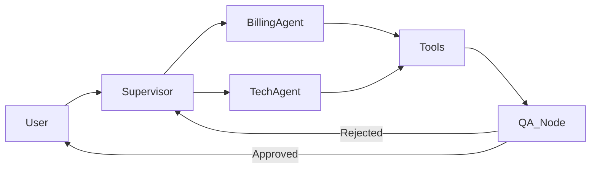

# 🤖 AutoDesk: Intelligent Support Agent
### Autonomous Multi-Agent System with LangGraph & FastAPI


---

## 🧠 The Concept
AutoDesk demonstrates the future of customer support: **Agentic AI**. Unlike simple chatbots that just "talk", AutoDesk is an **Orchestrator** that manages specialized "Worker Agents" (Billing, Tech Support) who have access to **real tools**.

It mimics a human support center:
*   **Supervisor**: Routes the ticket.
*   **Billing Agent**: Can actually *refund* transactions or check invoices.
*   **Reflector (QA)**: A self-correction loop that verifies the answer before sending it to the user.

---

## 🏗 Architecture
Built using the **LangGraph** state machine pattern:

1.  **Router**: Analyzes user intent (Billing vs. Tech).
2.  **Tool Execution**: Agents autonomously call Python functions (e.g., `check_server_status(id=55)`).
3.  **Reflection Loop**: If the answer is vague, the QA Node rejects it and forces the agent to try again.



---

## 💻 Tech Stack
*   **Orchestration**: LangGraph, LangChain.
*   **Backend**: FastAPI (Async high-performance server).
*   **Frontend**: Streamlit (Chat Interface).
*   **LLM Integration**: OpenRouter (GPT-4o, Claude 3.5 Sonnet).

## 🚀 Usage
1.  **Clone & Install**:
    ```bash
    git clone https://github.com/Rafi-Uddin15/autodesks-agent.git
    pip install -r requirements.txt
    ```
2.  **Run Server**:
    ```bash
    python server.py
    ```
3.  **Start UI**:
    ```bash
    streamlit run app.py
    ```

---
**Author**: Rafi Uddin | [LinkedIn](https://www.linkedin.com/in/rafi-uddin15)
