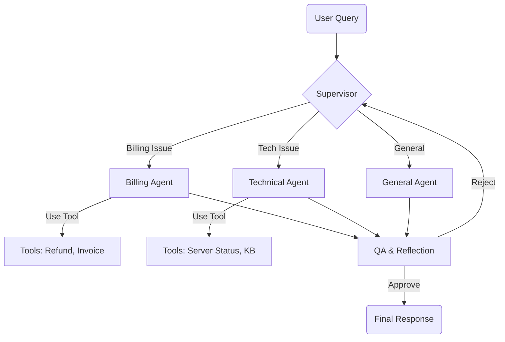

# ⚡ AutoDesk: Intelligent Support Orchestrator


**AutoDesk** is an enterprise-grade AI support system that demonstrates the **Orchestrator-Worker** and **Reflection** agentic patterns. Unlike simple chatbots, AutoDesk uses specialized agents with autonomous tools to perform real actions (refunds, server checks) and verifies its own answers before responding.

---

## 🏗 Architecture

The system is built on **LangGraph** and follows a multi-agent workflow:



## ✨ Features

*   **🧠 Intelligent Routing:** A Supervisor agent analyzes intent and routes tickets to the correct specialist.
*   **🛠 Autonomous Tools:** Agents can look up invoices (`INV-1234`), process refunds, and check server status.
*   **🛡 QA & Reflection:** A dedicated Quality Assurance node reviews every response for accuracy and politeness, rejecting bad answers automatically.
*   **⚡ Modern Stack:** Built with **FastAPI** (Backend) and **Streamlit** (Frontend) with a custom "Cyberpunk" UI.
*   **🔌 API-First:** Fully decoupled architecture allowing integration into any platform.

## 🚀 Quick Start

### Prerequisites
*   Python 3.10+
*   An API Key from [OpenRouter](https://openrouter.ai/) (supports Grok, GPT-4, Claude, etc.)

### Installation

1.  **Clone the repository:**
    ```bash
    git clone https://github.com/yourusername/autodesk-agent.git
    cd autodesk-agent
    ```

2.  **Install dependencies:**
    ```bash
    pip install -r requirements.txt
    ```

3.  **Configure Environment:**
    Create a `.env` file in the root directory:
    ```env
    OPENROUTER_API_KEY=sk-or-v1-your-key-here
    ```

### Running the System

**1. Start the Backend Server:**
```bash
python server.py
```
*   API runs at: `http://localhost:8000`
*   Health Check: `http://localhost:8000/health`

**2. Start the Frontend App:**
Open a new terminal and run:
```bash
python -m streamlit run app.py
```
*   App opens at: `http://localhost:8501`

## 🧪 Testing Scenarios

Try these inputs to see the agents in action:

| Intent | Query | Expected Behavior |
| :--- | :--- | :--- |
| **Billing** | *"I need a refund for invoice INV-1234"* | Agent checks invoice -> Sees "Unpaid" -> Denies refund. |
| **Technical** | *"Is server 55 online?"* | Agent checks status -> Reports status. |
| **General** | *"Hi, who are you?"* | Agent introduces itself. |

## 📂 Project Structure

*   `agents.py`: Logic for Supervisor, Billing, Tech, and QA agents.
*   `graph.py`: LangGraph state machine definition.
*   `tools.py`: Mock tools for billing and technical operations.
*   `server.py`: FastAPI backend exposing the graph.
*   `app.py`: Streamlit frontend with custom UI.
*   `main.py`: CLI version for testing in terminal.

## 📄 License

This project is licensed under the MIT License - see the [LICENSE](LICENSE) file for details.

---
*Built with ❤️ by Rafi Uddin

